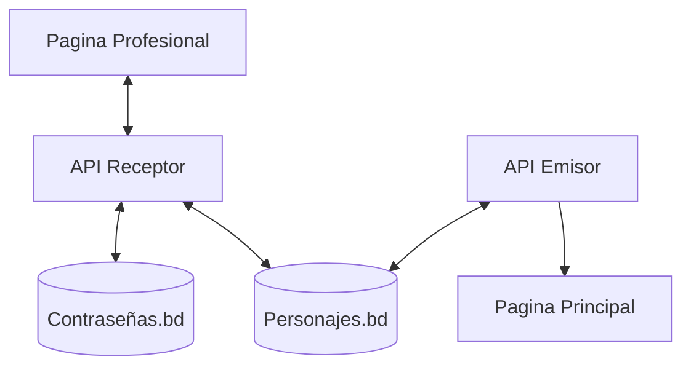

## Introducción
**EnciclopediaNen** es un proyecto personal orientado a probar el uso de APIs y bases de datos en un formato tipo wiki. El sistema cuenta con dos páginas: una de uso profesional, donde se ingresan datos mediante formularios conectados a distintas bases de datos; y otra pública, que permite visualizar esos datos de forma estilizada.

## Objetivos del Proyecto
El objetivo principal de EnciclopediaNen es explorar la integración entre APIs RESTful y bases de datos relacionales en un entorno de tipo wiki. Además, busca ofrecer una plataforma modular para registrar y consultar información personalizada del universo de _Hunter x Hunter_.

## Estructura del Sistema

## Tecnologías Utilizadas
- Frontend: HTML/CSS, JavaScript.
- Backend: Python (FastAPI, Flask).
- Base de datos: SQLite3.
- Herramientas adicionales: Obsidian para documentación, GitHub para control de versiones, etc.

## Requisitos de Ejecución
Para iniciar el entorno de trabajo, primero debe activar el entorno virtual utilizando el siguiente comando en la terminal  `.\.venv\Scripts\activate`. Una vez activado, ubique y ejecute las APIs correspondientes. Si todos los componentes están correctamente configurados, el sistema debería funcionar con normalidad.

Cambios técnicos detallados -> ver [[Change Logs]]